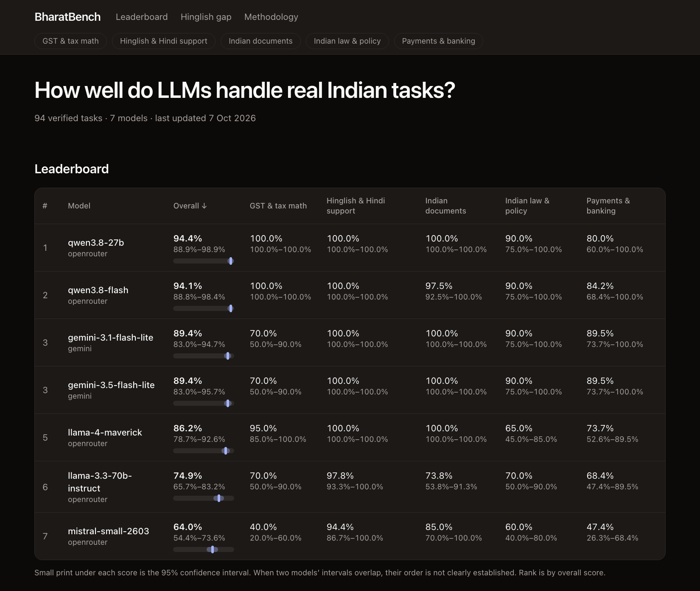

# BharatBench

A public benchmark of how well LLMs handle **real Indian tasks**: GST and tax math, Hinglish and Hindi customer support, extracting fields from Indian documents, Indian law and policy, and payments and banking support. Every task has a worked solution or an official source link, every document is synthetic, and a private held-out set guards against training on the answers.

**Live leaderboard: <https://bharatbench.vercel.app/>**

[](https://github.com/adityajamdhade6/bharatbench/actions/workflows/tests.yml)

## Headline finding

<!-- headline:start -->
- 7 models were scored on 94 verified tasks.
- Scores range from mistral-small-2603 at 64.0% to qwen3.8-27b at 94.4% (on 90 of 94 tasks; the rest could not be obtained), a 30.4-point spread.
- The top 5 models cannot be told apart statistically: their 95% confidence intervals overlap.
- The rule-heavy categories are the hard ones. Average accuracy across models is lowest on Payments & banking (76.1%), GST & tax math (77.9%) and Indian law & policy (79.3%), and highest on Hinglish & Hindi support (98.9%).
- There is no consistent Hinglish penalty: Hinglish is lower than English for 3 of 7 models, and averaged over models English is 82.9% against 86.2% for Hinglish. The tasks differ by language, so this is not a like-for-like comparison.
- The weakest single result is mistral-small-2603 on GST & tax math, at 40.0%.

*Run `run-5`; all figures are read from `results/run-5/scores.json`. Details: [analysis.md](analysis.md).*
<!-- headline:end -->



Read the numbers with the caveats in mind: there are few tasks per category, so intervals are wide, and the answer checks were done with AI assistance rather than by independent human reviewers (see [data/VERIFICATION.md](data/VERIFICATION.md)). Full results: [analysis.md](analysis.md).

## What it measures

| Category | What the tasks look like |
|---|---|
| GST & tax math | GST slabs, inclusive and exclusive prices, input credit, TDS, simple income tax |
| Hinglish & Hindi support | Classifying, extracting from and replying to customer messages |
| Indian documents | Fields and totals from synthetic invoices, rent agreements and bank statements |
| Indian law & policy | Consumer rights, RTI and labour basics, each tied to an official source |
| Payments & banking | UPI and card failures, refund timelines, liability and KYC rules |

Tasks are JSONL files in `data/` (schema: [data/schema/task.schema.json](data/schema/task.schema.json)). Answers are scored four ways: exact match, numeric (within 0.5%, understands ₹, commas, lakh and crore), field-by-field extraction, and an LLM judge for free-text rubrics. The judge is not used in the published results until it has been checked against human grades. See the site's methodology page for details.

## Run it

You need [uv](https://docs.astral.sh/uv/) (it installs Python 3.11 for you) and an API key for at least one provider (Gemini via Google AI Studio, Groq, or OpenRouter).

```bash
git clone https://github.com/adityajamdhade6/bharatbench.git
cd bharatbench
uv sync
cp .env.example .env        # then open .env and paste your key(s); .env is git-ignored
```

Check that the dataset is valid and the tests pass:

```bash
uv run python -m bharatbench.validate --expect-per-category 20
uv run pytest
```

Run a model over the verified tasks (a small first run, then everything):

```bash
uv run bharatbench run --models gemini-flash-lite --categories gst --limit 3
uv run bharatbench run --models gemini-flash-lite,llama-4-maverick,qwen-flash
```

Each run is saved to `results/<run_id>/responses.jsonl`. Score it, export it, and write the analysis:

```bash
uv run bharatbench score --run-id <run_id> --skip-rubric
uv run bharatbench export --run-id <run_id>          # -> site/data/leaderboard.json
uv run bharatbench report --run-id <run_id>          # -> analysis.md
```

Notes:

- Only tasks marked `"verified": true` are ever run, always at temperature 0.
- Every reply is cached in `.cache/responses/`, so re-running the same model on the same prompts costs nothing.
- `--limit` applies per category. `--categories` takes `gst`, `hinglish`, `docs`, `law`, `payments`.
- Free tiers have strict rate limits and daily quotas; the runner spaces calls and retries rate limits, and a model that exhausts a daily quota shows up as excluded replies, not wrong answers.
- Some models "think" before answering and can use up a small output budget. The default budget is generous; if a reasoning model returns empty replies, those are recorded as errors rather than scored.
- To rank the 6 rubric tasks you need a judge model: see `bharatbench judge-sample` and `judge-agree`.

### The website

```bash
cd site
npm install
npm run dev        # http://localhost:3000
```

The site reads only `site/data/leaderboard.json`; see [site/README.md](site/README.md) for deployment.

## Add a model

Any model on a supported provider needs no code. Pass `provider:model-id` (providers: `gemini`, `groq`, `openrouter`):

```bash
uv run bharatbench run --models openrouter:mistralai/mistral-large-2512
```

To give it a short name, add it to `MODEL_ALIASES` in [src/bharatbench/adapters/__init__.py](src/bharatbench/adapters/__init__.py).

To add a **new provider**, subclass `Adapter` (or `OpenAICompatAdapter` if it speaks the OpenAI chat format), implement `_request(prompt, system) -> str`, register it in `PROVIDERS` and `DEFAULT_RPM`, and add its key to `.env.example`. Raise `RateLimitError` or `TransientError` for retryable failures and `AdapterError` otherwise. Test it with `httpx.MockTransport`, as in [tests/test_adapters.py](tests/test_adapters.py): tests must never call a real API.

## Contribute tasks

Tasks are very welcome, especially Hindi, regional-language and domain-specific ones. The short version: add lines to a file in `data/`, include a worked solution or an official source, use only synthetic names and numbers, run `uv run python -m bharatbench.validate`, and open a pull request. Full guidelines, a template and the review checklist are in [CONTRIBUTING.md](CONTRIBUTING.md). Found a wrong answer? Please open an issue.

## Held-out set

The public set is **100 tasks**. A further **25 tasks (20% of all 125)** are held out privately and never published, so a model cannot be trained on their answers; comparing public and held-out accuracy is a contamination check. How it works, and what it cannot guarantee, is in [docs/HELDOUT.md](docs/HELDOUT.md).

## Licence and citation

- Code: [MIT](LICENSE).
- Data (`data/`, published results): [CC BY 4.0](LICENSE-DATA).
- To cite BharatBench, use [CITATION.cff](CITATION.cff) (GitHub's "Cite this repository" button reads it).

## Layout

```
data/            tasks (JSONL), schema, verification record
src/bharatbench/ adapters, scoring, runner, export, report, CLI
tests/           pytest (no real API calls)
results/         saved runs: responses, scores
site/            Next.js leaderboard (static export)
docs/            held-out policy, screenshot
```
